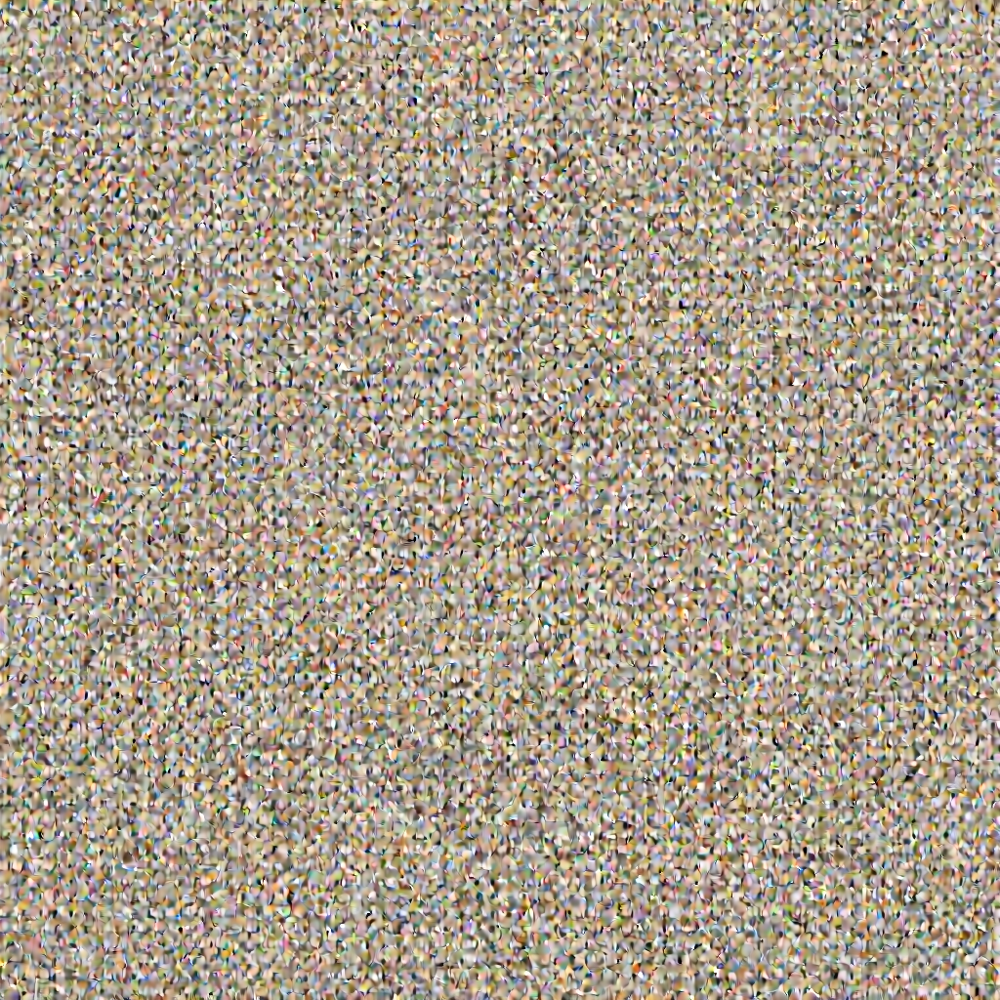

I trying to achieve [1.58bit flux](https://arxiv.org/abs/2412.18653) utilizing various llm quantization techniques, and this is the one of them.
[ParetoQ](https://arxiv.org/abs/2502.02631) is the one of the SoTA extremely low-bit llm quantization methods, I have adapted it to flux.
This was worked on 1.58bit quantization, but the image quality was not really satifying. So, I'll searching for another methods.

Below is the gpt-written readme of this repository.

---
# ParetoQ for FLUX (1.58‑bit)

ParetoQ-style low-bit (1.58b / 2b) quantization ported to the FLUX transformer (Diffusers). The core integration replaces linear layers with a quantization-aware LoRA layer and wires it into a Flux-compatible transformer.

- Core model: [`models.modeling_flux_quant.FluxTransformer2DModel`](models/modeling_flux_quant.py)
- Quantized linear: [`models.utils_quant.LoRAQuantizeLinear`](models/utils_quant.py)
- Sanity script: [sanity.py](sanity.py), shell wrapper: [0_sanity_check.sh](0_sanity_check.sh)
- QAT training: [train.py](train.py), shell wrapper: [1_run_train.sh](1_run_train.sh)
- One‑shot quantizer (static ternary): [run.py](run.py)
- Minimal test harness: [test.py](test.py)

Notes
- Weight bit modes used across the project (see [`models.modeling_flux_quant.FluxTransformer2DModel.__init__`](models/modeling_flux_quant.py)): `w_bits=16` (fp weights), `w_bits=0` (≈1.58-bit), `w_bits=2` (2-bit).
- Dataset caching for QAT is auto-generated from prompts (see [train.py](train.py)) and stored under `output_dir/dataset/`.

## Environment

- Conda (recommended): `conda env create -f environment.yaml && conda activate flux158`
- Or pip (CUDA environment pre-installed):
  - `pip install torch diffusers transformers accelerate safetensors pillow torchvision tqdm`

## Quickstart: Sanity (image generation + quantized model load)

Linux/macOS:
```sh
bash 0_sanity_check.sh
```

Windows:
```sh
python sanity.py \
  --local_dir "/tmp/flux/" \
  --input_model_filename "black-forest-labs/FLUX.1-dev" \
  --output_model_filename "flux-dev" \
  --do_train True \
  --do_eval False \
  --bf16 True \
  --logging_dir /tmp/output/runs/current \
  --num_train_epochs 1 \
  --per_device_train_batch_size 2 \
  --gradient_accumulation_steps 1 \
  --evaluation_strategy "no" \
  --save_strategy "steps" \
  --save_steps 2000 \
  --report_to "tensorboard" \
  --save_total_limit 1 \
  --learning_rate 2e-5 \
  --weight_decay 0. \
  --warmup_ratio 0. \
  --lr_scheduler_type "cosine" \
  --logging_steps 1 \
  --tf32 False \
  --gradient_checkpointing False \
  --qat True \
  --w_bits 0
```

What it does:
- Loads the full-precision pipeline, generates a few images, then swaps in a quantized transformer built via [`sanity.load_quantized_model`](sanity.py) using [`models.modeling_flux_quant.FluxTransformer2DModel`](models/modeling_flux_quant.py).

Outputs:
- Samples under `output_dir/samples/...` (see [sanity.py](sanity.py)).

## One‑shot ternary quantization (static, no QAT)

Use [run.py](run.py) to ternary‑quantize DiT weights and save a compact Diffusers pipeline.

```sh
python run.py \
  --model_id black-forest-labs/FLUX.1-dev \
  --output_path ./flux_1p58bit \
  --threshold_ratio 0.05 \
  --num_images 2
```

- The script swaps in [`models.modeling_flux_quant.FluxTransformer2DModel`](models/modeling_flux_quant.py) and quantizes all linear weights (see usage of [`models.modeling_flux_quant.QuantizeLinear`](models/modeling_flux_quant.py), implemented as [`models.utils_quant.LoRAQuantizeLinear`](models/utils_quant.py)).

Artifacts:
- Quantized pipeline under `./flux_1p58bit/` and optional `./flux_1p58bit/samples/`.

## QAT (Quantization‑Aware Training)

The training entrypoint is [train.py](train.py). It:
1) Builds a prompt dataset by sampling with the original model and storing inputs/outputs under `output_dir/dataset/`.
2) Loads a quantized model via [`train.load_quantized_model`](train.py), with proper weight clip initialization.
3) Runs MSE loss between model outputs and cached targets using a minimal Trainer ([utils/trainer.py](utils/trainer.py)).

Single‑node multi‑GPU (Linux/macOS):
```sh
# nproc_per_node = GPUs, batch = per-device batch, accum = grad accumulation
bash 1_run_train.sh 1 4 1
```

Manual:
```sh
torchrun --nproc_per_node=1 train.py \
  --local_dir "/tmp/flux/" \
  --input_model_filename "black-forest-labs/FLUX.1-dev" \
  --output_model_filename "flux-dev" \
  --do_train True \
  --do_eval True \
  --bf16 True \
  --per_device_train_batch_size 4 \
  --gradient_accumulation_steps 1 \
  --evaluation_strategy "no" \
  --learning_rate 2e-5 \
  --lr_scheduler_type "cosine" \
  --logging_steps 1
```

Key knobs:
- Bits: set `--w_bits {16|2|0}` (0 ≈ 1.58‑bit).
- Gradient checkpointing: `--gradient_checkpointing True` (supported via `enable_gradient_checkpointing()` in [train.py](train.py)).
- Dataset size and prompts: see [`utils/prompt_list.py`](utils/prompt_list.py) and dataset creation path in [train.py](train.py).

## Testing a saved quantized checkpoint

```sh
python test.py /path/to/cache_or_checkpoint 0
```

- `w_bits` must match the saved model.
- The test harness expects a saved transformer checkpoint (see `save_pretrained(cache_dir)` in [sanity.py](sanity.py) and [train.py](train.py)).

## Implementation map

- Flux model (quantized):
  - [`models.modeling_flux_quant.FluxTransformer2DModel`](models/modeling_flux_quant.py)
  - Attention/blocks wiring with quantized linears: [`models.modeling_flux_quant.Attention`](models/modeling_flux_quant.py), [`models.modeling_flux_quant.FeedForward`](models/modeling_flux_quant.py), [`models.modeling_flux_quant.FluxTransformerBlock`](models/modeling_flux_quant.py), [`models.modeling_flux_quant.FluxSingleTransformerBlock`](models/modeling_flux_quant.py)
- Quant ops:
  - LSQ-style binary/ternary and stretched elastic quant: [`models.utils_quant.LsqBinaryTernaryExtension`](models/utils_quant.py), [`models.utils_quant.StretchedElasticQuant`](models/utils_quant.py)
  - LoRA QLinear wrapper (used as QuantizeLinear): [`models.utils_quant.LoRAQuantizeLinear`](models/utils_quant.py)
- Model I/O:
  - Sanity loader: [`sanity.load_quantized_model`](sanity.py)
  - Training loader: [`train.load_quantized_model`](train.py)

## Tips

- Use BF16 on CUDA (`--bf16 True`) for speed/memory.
- If OOM: lower `--per_device_train_batch_size`, increase `--gradient_accumulation_steps`.
- Windows: use WSL/Git Bash for the shell scripts or run `python` commands

## Results

- Folder: [assets/](assets)

### Sample output

<table>
  <tr>
    <td align="center">
      <a href="assets/sample_000.png"></a><br/>
      <sub>sample_000</sub>
    </td>
  </tr>
</table>

### QAT snapshots

<table>
  <tr>
    <td align="center">
      <a href="assets/step-0.png"></a><br/>
      <sub>Step 0</sub>
    </td>
    <td align="center">
      <a href="assets/step-500.png"></a><br/>
      <sub>Step 500</sub>
    </td>
    <td align="center">
      <a href="assets/step-1000.png"></a><br/>
      <sub>Step 1000</sub>
    </td>
  </tr>
  <tr>
    <td align="center">
      <a href="assets/step-2000.png"></a><br/>
      <sub>Step 2000</sub>
    </td>
    <td align="center">
      <a href="assets/step-4000.png"></a><br/>
      <sub>Step 4000</sub>
    </td>
    <td align="center">
      <a href="assets/step-6000.png"></a><br/>
      <sub>Step 6000</sub>
    </td>
  </tr>
  <tr>
    <td align="center">
      <a href="assets/step-8000.png"></a><br/>
      <sub>Step 8000</sub>
    </td>
    <td align="center">
      <a href="assets/step-10000.png"></a><br/>
      <sub>Step 10000</sub>
    </td>
    <td align="center">
      <a href="assets/step-11000.png"></a><br/>
      <sub>Step 11000</sub>
    </td>
  </tr>
</table>

<sub>Click any image to view full resolution.</sub>